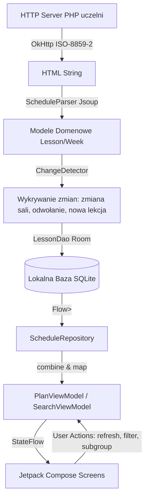

# Architektura Systemu — cwupSchedule

Dokument przedstawia architekturę techniczną aplikacji mobilnej **cwupSchedule** dla studentów Collegium Witelona w Legnicy.

---

## 1. Podział na Moduły (Modular Design)

Projekt podzielony jest na dwa odseparowane moduły Gradle:

```
               ┌─────────────────────────────────────┐
               │         :parser (Pure JVM)          │
               │  - Jsoup HTML parsing               │
               │  - Domenowe modele danych           │
               │  - Detekcja ISO-8859-2 / regexy     │
               │  - Testy jednostkowe bez Android SDK│
               └──────────────────┬──────────────────┘
                                  │ implementation(project(":parser"))
                                  ▼
               ┌─────────────────────────────────────┐
               │           :app (Android)            │
               │  - UI: Jetpack Compose + Material3  │
               │  - DI: Hilt (Dagger)                │
               │  - DB: Room + KSP                   │
               │  - Preferences: DataStore           │
               │  - Background: WorkManager          │
               │  - Alarms: Exact AlarmManager       │
               │  - Desktop Widget: Jetpack Glance   │
               └─────────────────────────────────────┘
```

### Dlaczego czysty moduł JVM dla parsera?
1. **Szybkość testów:** Testy jednostkowe parsera wykonują się w ułamku sekundy bez potrzeby uruchamiania Robolectric ani emulatora.
2. **Niezależność:** Moduł parsera może zostać w przyszłości użyty w bocie Telegram/Discord, backendzie REST API lub aplikacji desktopowej Compose Multiplatform bez zmian w kodzie.

---

## 2. Przepływ Danych (Unidirectional Data Flow)

Aplikacja realizuje wzorzec **Offline-First** oraz jednokierunkowy przepływ danych (UDF):



---

## 3. Warstwa Danych (Data Layer)

### Baza Danych Room (`AppDatabase`)
- `LessonEntity`: pojedyncze zajęcia (data, godziny, przedmiot pełny/skrócony, typ zajęć, sala, flaga online, prowadzący, podgrupa, parzystość tygodnia, flaga zmian).
- `DepartmentEntity`: wydział uczelni (id, nazwa).
- `StudyCourseEntity`: kierunek studiów powiązany z wydziałem.
- `StudyGroupEntity`: grupa studencka (kod, nazwa, link do planu).
- `TeacherEntity` i `RoomEntity`: pamięć podręczna wykładowców i sal dla modułu wyszukiwarki.
- `ScheduleMetadataEntity`: data ostatniej pomyślnej synchronizacji, hash planu, dostępne tygodnie w semestrze.

### DataStore Preferences (`UserPreferencesRepository`)
Przechowuje preferencje użytkownika jako reaktywny strumień `Flow<UserPreferences>`:
- Wybrany wydział, kierunek, kod grupy i podgrupa laboratoryjna.
- Tryb filtrowania (`ALL`, `CAMPUS_ONLY`, `ONLINE_ONLY`).
- Opcja scalania bloków (`mergeConsecutiveBlocks`).
- Tryb widoku (`UPCOMING`, `DAY_BY_DAY`).
- Flaga motywu AMOLED (`isAmoledTheme`).
- Status powiadomień (`notificationsEnabled`).
- Flaga ukończenia powitania (`onboardingCompleted`).

---

## 4. Architektura Powiadomień (AlarmManager Engine)

Tradycyjne aplikacje mobilne często utrzymują stały proces `Foreground Service` z ciągłą ikonką w pasku powiadomień, co powoduje niepotrzebne zużycie baterii i ryzyko zabicia procesu przez mechanizmy OEM (MIUI/HyperOS, One UI).

W cwupSchedule zastosowano w 100% bezstanowy silnik domenowy:
- `NotificationSchedulerEngine`: czysta klasa domenowa obliczająca dokładny czas (`Instant`) kolejnego zdarzenia powiadomienia (60 min przed zajęciami, rozpoczęcie lekcji, zakończenie lekcji, wygaszenie).
- `AlarmManager.setExactAndAllowWhileIdle`: rejestruje wybudzenie systemu dokładnie o wyliczonym czasie.
- `ScheduleAlarmReceiver`: odbiera zdarzenie, pobiera aktualne lekcje z bazy i wywołuje `NotificationPublisher`.
- `NotificationPublisher`: publikuje lub aktualizuje powiadomienie w miejscu (stały `NOTIFICATION_ID = 1001`), stosując `setOnlyAlertOnce(true)`, dzięki czemu telefon nie wibruje przy cichej aktualizacji licznika czasu.

Szczegółowa specyfikacja algorytmu znajduje się w [docs/NOTIFICATIONS.md](NOTIFICATIONS.md).

---

## 5. Synchronizacja w Tle (WorkManager)

Okresowe pobieranie aktualizacji planu zajęć realizowane jest przez `ScheduleSyncWorker`:
- Uruchamiany co 6 godzin za pomocą `PeriodicWorkRequestBuilder`.
- Wymóg ograniczenia sieciowego: `NetworkType.CONNECTED`.
- Po pomyślnym pobraniu i zapisaniu zmian w Room, worker wywołuje automatyczną aktualizację widgetu pulpitu `ScheduleGlanceWidget.updateWidget(context)`.

---

## 6. Widget Pulpitu (Jetpack Glance)

Widget zbudowany w oparciu o bibliotekę **Jetpack Glance 1.1.1** (deklaratywne UI oparte o podzbiór Compose tłumaczone na zdalne widoki `RemoteViews`):
- Obsługuje `SizeMode.Responsive` z trzema progami rozmiarów:
  - 2x2: najbliższa lekcja, sala/online, czas.
  - 4x2: nagłówek z datą i kodem grupy, 2 najbliższe lekcje.
  - 4x4: pełny podgląd dnia (do 5 lekcji).
- Wstrzykiwanie zależności: wewnątrz `provideGlance` wykorzystywany jest `EntryPointAccessors.fromApplication` (`WidgetEntryPoint`) do bezpiecznego odpytania bazy Room i DataStore.
